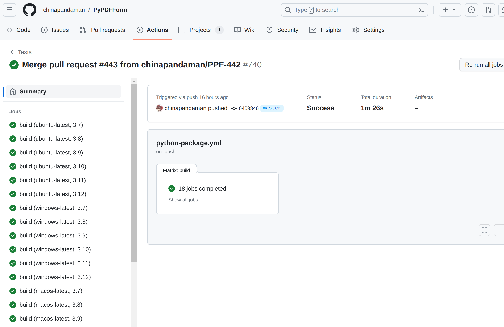
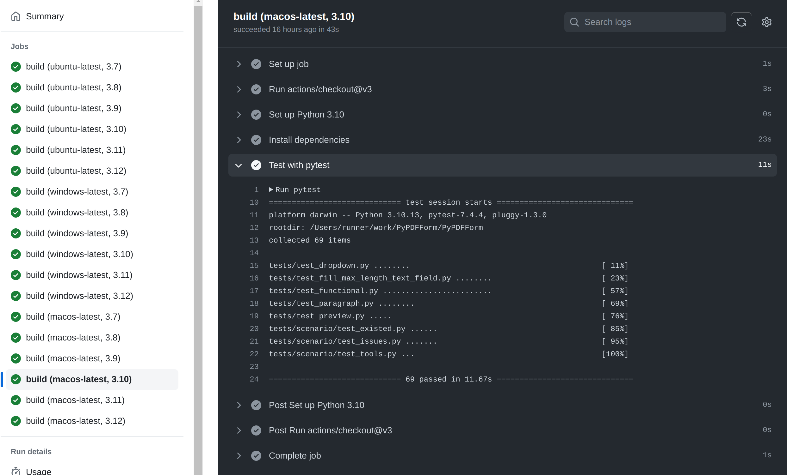
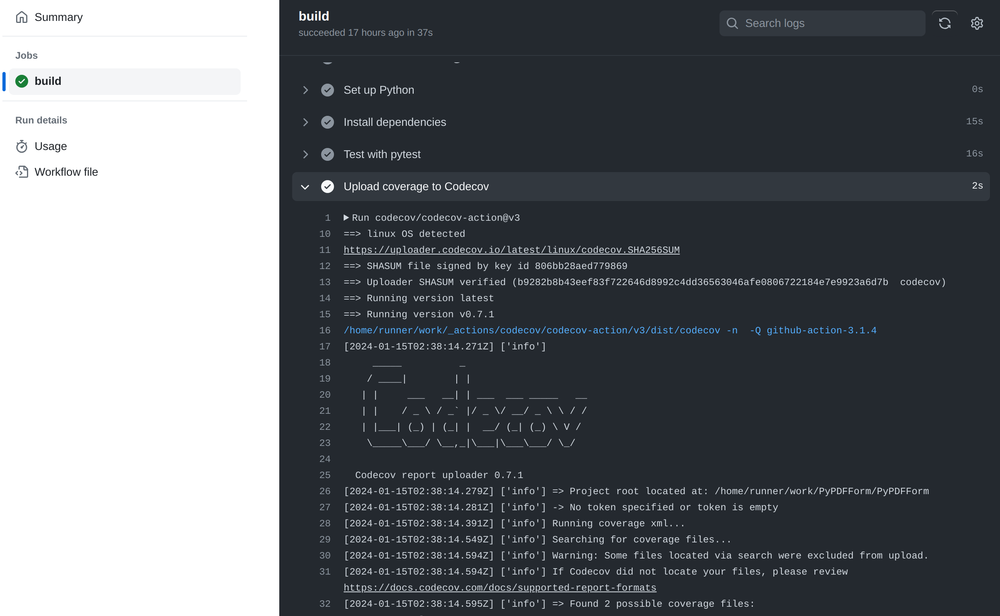
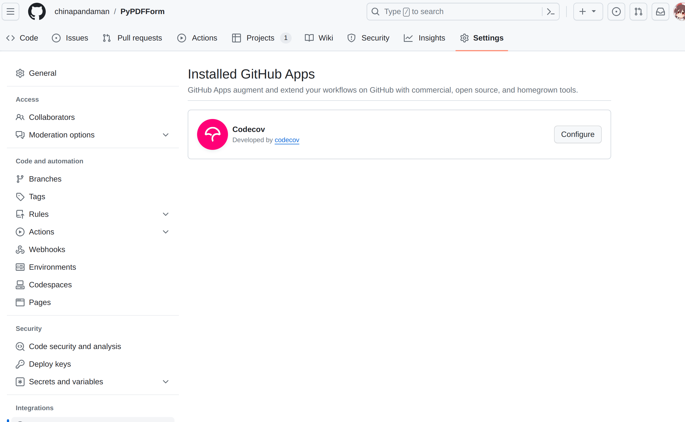
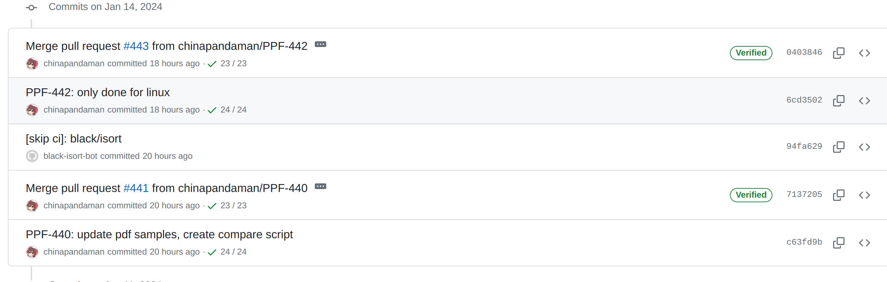
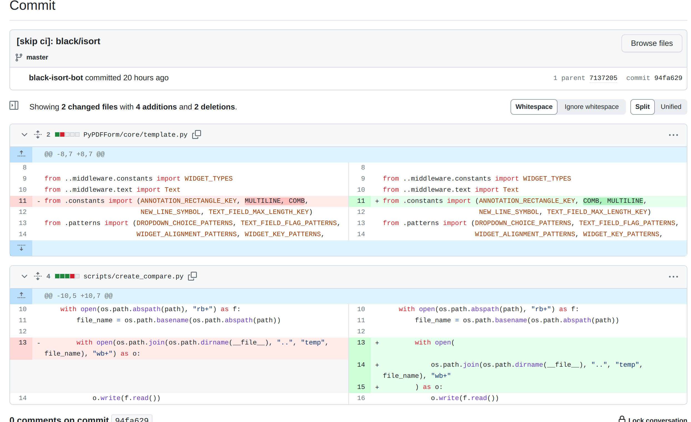
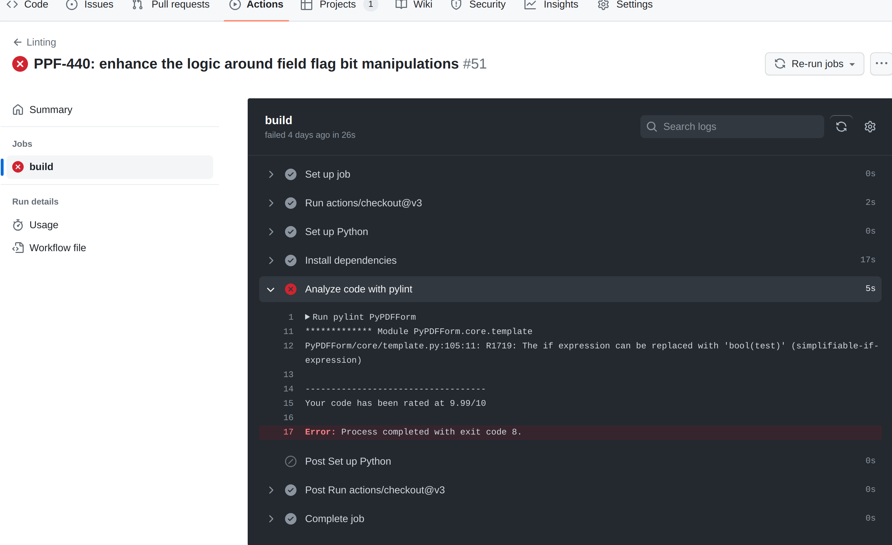
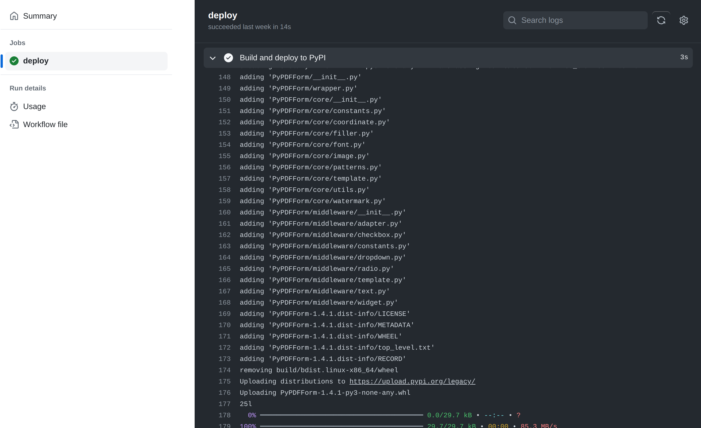

### Preface

Happy new year fellow developers! The [speak](https://youtu.be/8t1RdAKwr9w?si=AcsOtfFHjuuoVOXC) I did at the Chicago Python User Group was a huge success and I hope everyone enjoyed it. I’d like to start a series of blogs which will cover a number of subjects related to [PyPDFForm](https://github.com/chinapandaman/PyPDFForm). These subjects will hopefully cover some of the more in depth technical details that I didn’t get to cover during my speak.

In this first blog, I want to talk about all the CI/CD pipelines I have set up for the project that ensured its stability and automation. These pipelines are also in my opinion quite general purpose and can be used by any Python project in the future.

<!-- more -->

### Test Automation

PyPDFForm uses GitHub actions for all its CI/CD pipelines. When it comes to continuous integration, the first one that pretty much any project should have is build and test automation. PyPDFForm implements [all its tests](https://github.com/chinapandaman/PyPDFForm/tree/master/tests) using [pytest](https://pypi.org/project/pytest/) and since Python is an interpreted language it doesn't need a lot of build steps other than downloading dependencies. The [following action](https://github.com/chinapandaman/PyPDFForm/blob/master/.github/workflows/python-package.yml) defines the pipeline for PyPDFForm's test automation:

```yaml
name: Tests

on:
  push:
    branches: [ master ]
  pull_request:
    branches: [ master ]

jobs:
  build:

    runs-on: ${{ matrix.os }}
    strategy:
      matrix:
        os: [ubuntu-latest, windows-latest, macos-latest]
        python-version: [3.7, 3.8, 3.9, "3.10", 3.11, 3.12]

    steps:
    - uses: actions/checkout@v3
    - name: Set up Python ${{ matrix.python-version }}
      uses: actions/setup-python@v4
      with:
        python-version: ${{ matrix.python-version }}
    - name: Install dependencies
      run: |
        python -m pip install --upgrade pip
        pip install -r requirements.txt
    - name: Test with pytest
      run: |
        pytest
```

Let's look at this block by block to get a better understanding of it. First:

```yaml
on:
  push:
    branches: [ master ]
  pull_request:
    branches: [ master ]
```

This chunk defines the condition that triggers this action. In this case we want to run our tests when there's a PR created or if a commit is made directly towards the `master` branch.

This next section defines all the environments that the tests should be run on:

```yaml
    runs-on: ${{ matrix.os }}
    strategy:
      matrix:
        os: [ubuntu-latest, windows-latest, macos-latest]
        python-version: [3.7, 3.8, 3.9, "3.10", 3.11, 3.12]
```

GitHub action has a very nice way of defining environments with the matrix strategy. In this case I would like to test PyPDFForm on all three operating systems. For each os I want to test  all the currently supported Python versions. Overall these environment definitions will kick off 3x6=18 different builds when this action is invoked.



Now the actual pipeline itself is divided into four steps. The first two steps simply checkout the source code and setup the Python environment, both of which use other existed actions:

```yaml
    - uses: actions/checkout@v3
    - name: Set up Python ${{ matrix.python-version }}
      uses: actions/setup-python@v4
      with:
        python-version: ${{ matrix.python-version }}
```

Note the `python-version` references the `python-verion` environment definition from the matrix.

The next step is to install the dependencies. Python unlike some other compiled languages doesn't need a build process most of the time. So a simple `pip install` is enough for this step:

```yaml
    - name: Install dependencies
      run: |
        python -m pip install --upgrade pip
        pip install -r requirements.txt
```

And finally we get to actually run the tests, which is just a simple `pytest` command:

```yaml
    - name: Test with pytest
      run: |
        pytest
```



Now we have a pretty standard action for running automated tests.

### Code Coverage

The action for code coverage generation used to be part of the test automation action discussed in the last section. It was changed and became its own action in [this PR](https://github.com/chinapandaman/PyPDFForm/pull/397).

The reason behind this is exactly what the title of the PR says. It is meant to reduce the number of times code coverage is uploaded to Codecov. There seems to be an issue either on GitHub or Codecov where too many coverage uploads will start causing API rate limits, described in [this issue](https://github.com/codecov/feedback/issues/126).

With the old way, every time the test action is run there will be eighteen submissions of coverage to Codecov and it has caused me the above issue. So now code coverage is its own separate [action](https://github.com/chinapandaman/PyPDFForm/blob/master/.github/workflows/python-coverage.yml):

```yaml
name: Coverage

on:
  push:
    branches: [ master ]
  pull_request:
    branches: [ master ]

jobs:
  build:

    runs-on: ubuntu-latest

    steps:
    - uses: actions/checkout@v3
    - name: Set up Python
      uses: actions/setup-python@v4
      with:
        python-version: '3.x'
    - name: Install dependencies
      run: |
        python -m pip install --upgrade pip
        pip install -r requirements.txt
    - name: Test with pytest
      run: |
        coverage run -m pytest
    - name: Upload coverage to Codecov
      uses: codecov/codecov-action@v3
```

This action is very similar to the test automation action, with two major differences. First:

```yaml
    runs-on: ubuntu-latest
```

```yaml
    - name: Set up Python
      uses: actions/setup-python@v4
      with:
        python-version: '3.x'
```

With the above environment definition, this action will only run once on the latest version of Ubuntu, using the latest version of Python. This means it will only upload the code coverage once, having a much less chance of triggering the rate limits.

And finally there's an extra step after the tests are run that uploads the coverage to Codecov:

```yaml
    - name: Upload coverage to Codecov
      uses: codecov/codecov-action@v3
```



It is also worth noting that PyPDFForm does integrate the Codecov GitHub app to better work with this action.



In the future if the rate limiting issue does get resolved, this action will likely be re-merged back to the test automation action.

### Code Formatting

PyPDFForm uses two methods to ensure code quality. The first one is the automated code formatting action. Python has two great code formatting tools: [black](https://pypi.org/project/black/) which formats all Python files in your source code, and [isort](https://pycqa.github.io/isort/) which fixes all your import orders.

PyPDFForm makes use of `black` and `isort` with the following [action](https://github.com/chinapandaman/PyPDFForm/blob/master/.github/workflows/python-black-isort.yml):

```yaml
name: Code Formatting

on:
  push:
    branches: [ master ]

jobs:
  build:
    runs-on: ubuntu-latest

    steps:
      - uses: actions/checkout@v3
        with:
          token: ${{ secrets.BLACK_ISORT_TOKEN }}
      - name: Set up Python
        uses: actions/setup-python@v4
        with:
          python-version: '3.x'
      - name: Install black/isort
        run: pip install black isort
      - name: If needed, commit black/isort changes to the pull request
        run: |
          black .
          isort .
          git config --global user.name 'black-isort-bot'
          git config --global user.email 'bot@domain.com'
          git diff --quiet && git diff --staged --quiet || git commit -am '[skip ci]: black/isort'
          git push
```

Unlike the test automation action, this action only runs when a commit is made to the `master` branch:

```yaml
on:
  push:
    branches: [ master ]
```

This is to ensure that none of the automated formatting will mess up diffs between branches and `master` in PRs.

```yaml
      - uses: actions/checkout@v3
        with:
          token: ${{ secrets.BLACK_ISORT_TOKEN }}
```

The checkout source code step of the pipeline now makes use of a secret token called `BLACK_ISORT_TOKEN`. This is actually a GitHub developer token of mine stored under the repository's secrets. We will talk about why it's needed later on.

To actually use `black` and `isort`, obviously they will need to be installed:

```yaml
      - name: Install black/isort
        run: pip install black isort
```

And finally, the following chunk gets executed:

```yaml
      - name: If needed, commit black/isort changes to the pull request
        run: |
          black .
          isort .
          git config --global user.name 'black-isort-bot'
          git config --global user.email 'bot@domain.com'
          git diff --quiet && git diff --staged --quiet || git commit -am '[skip ci]: black/isort'
          git push
```

In this step, the following happens in order:

1. `black` is run on all Python files.
2. `isort` is run on all Python files.
3. Some `git` configurations are set so that a commit can be made.
4. Two `git diff` commands are run to determine if any file is modified as a result of `black` or `isort`. If so a new commit is made with modified files.
5. The commit is pushed to `master`.

Note the commit message starts with `[skip ci]`. This way it will not trigger any new action after being pushed to `master`. This is intended as this commit only has code formatting changes.

Now you can see why the GitHub developer token needs to be setup when we initially checkout the source code. The credential is needed when we push the code formatting changes back to `master`.




Above you can see an example that shows the outcome of this action.

### Static Analysis

In conjunction with the code formatting action, the following [action](https://github.com/chinapandaman/PyPDFForm/blob/master/.github/workflows/python-linting.yml) utilizes [pylint](https://pypi.org/project/pylint/#:~:text=Pylint%20is%20a%20static%20code,code%20without%20actually%20running%20it.) to statically analyze the project to cover some loopholes `black` might miss:

```yaml
name: Linting

on:
  push:
    branches: [ master ]
  pull_request:
    branches: [ master ]

jobs:
  build:

    runs-on: ubuntu-latest

    steps:
    - uses: actions/checkout@v3
    - name: Set up Python
      uses: actions/setup-python@v4
      with:
        python-version: '3.x'
    - name: Install dependencies
      run: |
        python -m pip install --upgrade pip
        pip install -r requirements.txt
    - name: Analyze code with pylint
      run: |
        pylint PyPDFForm
```

This action is 90% the same as the test automation action except the following:

```yaml
    - name: Analyze code with pylint
      run: |
        pylint PyPDFForm
```

Instead of running tests with `pytest`, it runs `pylint` on the source code for a static analysis.



`pylint`, paired up with `black` and `isort`, will ensure that PyPDFForm always has a clean, but more importantly a unified code style, regardless how each developer's own coding style varies.

### Deploy

So far we have only covered continuous integrations of PyPDFForm. It's time to talk about the [action](https://github.com/chinapandaman/PyPDFForm/blob/master/.github/workflows/python-publish.yml) that allows it to be continuously deployed:

```yaml
name: Deploy

on:
  release:
    types: [created]

jobs:
  deploy:

    runs-on: ubuntu-latest

    steps:
    - uses: actions/checkout@v3
    - name: Set up Python
      uses: actions/setup-python@v4
      with:
        python-version: '3.x'
    - name: Install dependencies
      run: |
        python -m pip install --upgrade pip
        pip install setuptools wheel twine
    - name: Build and deploy to PyPI
      env:
        TWINE_USERNAME: __token__
        TWINE_PASSWORD: ${{ secrets.PYPI_PASSWORD }}
      run: |
        python setup.py sdist bdist_wheel
        twine upload dist/*
```

This action, unlike any other action we have discussed so far, is triggered when a **release** is made:

```yaml
on:
  release:
    types: [created]
```

The first few steps of the pipeline is quite similar to the other ones, checkout the source, setup Python, etc. The part we care about starts here:

```yaml
    - name: Install dependencies
      run: |
        python -m pip install --upgrade pip
        pip install setuptools wheel twine
```

The above will install `setuptools`, `wheel`, and `twine`, all of which are dependencies we need to package and deploy our projects.

Finally, this is where the actual deployment happens:

```yaml
    - name: Build and deploy to PyPI
      env:
        TWINE_USERNAME: __token__
        TWINE_PASSWORD: ${{ secrets.PYPI_PASSWORD }}
      run: |
        python setup.py sdist bdist_wheel
        twine upload dist/*
```

It first packages the project based on the [setup.py](https://github.com/chinapandaman/PyPDFForm/blob/master/setup.py) following [this guide](https://packaging.python.org/en/latest/guides/distributing-packages-using-setuptools/#packaging-your-project), and then uploads the packaged files to PyPI.

Note that this step uses two environment variables: `TWINE_USERNAME` which is set to `__token__`, and `TWINE_PASSWORD` which references a secret called `PYPI_PASSWORD`. These two variables configure the credential needed for PyPI and are what allow the final upload to happen.



It is also worth noting that this step will need to be changed soon, as packaging by calling `setup.py` directly is [deprecated](https://blog.ganssle.io/articles/2021/10/setup-py-deprecated.html).

### Conclusion

Some of these actions were created from a while ago and it is quite possible that GitHub actions and Python suggest new best practices. But I think this article highlights a skeleton of how some CI/CDs can be done for Python projects and I hope anyone who is reading find this helpful.
