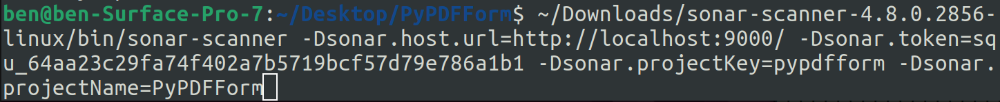

### Motivation

While working on [PyPDFForm](https://github.com/chinapandaman/PyPDFForm), I implemented many different mechanisms to ensure the code quality of the project. Some of these include:

* Testing using [pytest](https://pytest.org/).
* Uploading coverage data to [codecov](https://app.codecov.io/gh/chinapandaman/PyPDFForm).
* Formatting the code using [black/isort](https://github.com/chinapandaman/PyPDFForm/blob/master/.github/workflows/python-black-isort.yml).
* Linting using [pylint](https://pypi.org/project/pylint/).

Recently I have learned about the community loved static analysis tool [SonarQube](https://www.sonarsource.com/products/sonarqube/). So I ask myself what kind of static analysis result I would get from it, especially with all these mechanisms I already have to ensure code quality. In this blog, I will find out answers to this exact question.

<!-- more -->

### Setup Sonar

For now all I want is to see some analysis results from Sonar for PyPDFForm. There is no intention of making Sonar part of the CI pipeline yet. So there is no need of hosting Sonar on a remote server, instead all I want is to simply host Sonar locally and run a couple scans. Luckily Sonar does provide a way of doing that in [this](https://docs.sonarqube.org/latest/try-out-sonarqube/) documentation.

The first step is to setup a local host for Sonar. As part of the prerequisites hosting Sonar requires Java 17 for version 10.0, which is something that's already installed on my machine.


The next thing is to download the zip file for Sonar host from [here](https://www.sonarsource.com/products/sonarqube/downloads/). Here I downloaded the community edition of it.

After unzipping the zip file it is pretty simple to start the server by running the following:

```shell
<path_to_unzipped_folder>/bin/<OS>/sonar.sh console
```

In my case I'm on a Surface Pro running Ubuntu. So the command would look like:

```shell
<path_to_unzipped_folder>/bin/linux-x86-64/sonar.sh console
```


Execute the command and wait for it to finish spinning up the server. It is done when these prompts show up:


Now if I go to [http://localhost:9000/](http://localhost:9000/), I will see this page which indicates Sonar is up and running locally:


Enter admin/admin for login/password, it will then redirect me to a page where I need to change the admin password. Once done Sonar host will be ready to use.


Now that I have the host setup, the next thing I need is the scanner that actually scans the code. For my purpose I'm downloading the generic Sonar scanner from [here](https://docs.sonarqube.org/latest/analyzing-source-code/scanners/sonarscanner/). Unzip the zip file and it will be ready to use.


### Analyze PyPDFForm

I have both the Sonar host and Sonar scanner setup. It's time to run my first scan against PyPDFForm.

Before I start scanning, I need to first generate a token from the Sonar host given that's how Sonar authenticates. The token can be generated from [this page](http://localhost:9000/account/security). Here I named my token `local` and selected the type `User Token`:


Once I have my token it can be used as part of the Sonar scanner command. Here is what it typically looks like:

```shell
<path_to_unzipped_scanner_folder>/bin/sonar-scanner -Dsonar.host.url=http://localhost:9000/ -Dsonar.token=<generated_token> -Dsonar.projectKey=<project_key> -Dsonar.projectName=<project_display_name>
```

In my case, the command looks like this:



Let's look at this command piece by piece:

* `-Dsonar.host.url` specifies the host URL of the Sonar server, which in my case is the local host.
* `-Dsonar.token` is the token I just generated.
* `-Dsonar.projectKey` is the unique identifier of the project.
* `-Dsonar.projectName` is the display name of the project.

Execute the command and the scanner will kick off the scan. Wait until it finishes:


Now if I refresh the Sonar host's home page, I can see my new project show up there:


If I click on the project and open up its dashboard I can see the analysis result of my first scan:


So the good news is that my project seems to have no bugs, vulnerabilities, security hotspots, and duplications. All good stuffs and I can see how all those code quality mechanisms have helped me to achieve these.

The not so good news are:

* The coverage shows as 0%.
* There are some code smells.

For coverage I know PyPDFForm as a project has 100% coverage since I have introduced Codecov as part of my CI pipeline. For Sonar all I need to do is to upload my coverage data. This means I need to run another scan while specifying where Sonar should upload my coverage file.

So first of all let me re-run tests and generate a new coverage file:


After that my new Sonar scanner command looks like this:


Here I introduced another option `-Dsonar.python.coverage.reportPaths` which tells Sonar the location of my coverage file. For more information about test coverage on Sonar please read [here](https://docs.sonarqube.org/latest/analyzing-source-code/test-coverage/overview/).

Execute the command, wait until the scan finishes, and now let's look at the dashboard:


Now the coverage is no longer 0%, but instead of the expected 100% it shows 57%.

Let's look into why this is the case by clicking on the `Code` tab of the dashboard.


And here I found out why. It looks like the main package of `PyPDFForm` does have 100% coverage. It's just that Sonar scanned some other files which are neither covered nor intended to be covered.

This means I will have to exclude certain files from my Sonar scans. Let's modify my Sonar scanner command one more time:


Here I added the option `-Dsonar.exclusions` which tells Sonar some files or directories I would like to exclude from the scan.

Execute the command and let's look at the dashboard again:


Finally the coverage is 100%. But there are still 4 code smells shown on the dashboard. Let's take a look at them by clicking on the `Issues` tab.


So all 4 code smells seem to point to the same thing, which is some of my functions could use some refactoring to reduce cognitive complexity. This is mostly due to complex logic such as too many if else blocks within a single function. For example:


However, Sonar gave it a maintainability score of `A`, which seems to indicate it's nothing major. On top of that reducing complexity of functions is something I have been continuously doing anyway while working on PyPDFForm.


### Conclusion

Overall I'd say the outcome of Sonar analysis against PyPDFForm is excellent. It is a pleasure to know that all the previous effort I put into code quality assurance is recognized by the community loved static analysis tool. I would also recommend anyone who reads this blog give SonarQube a try as it is a great tool and will make your code much cleaner.
