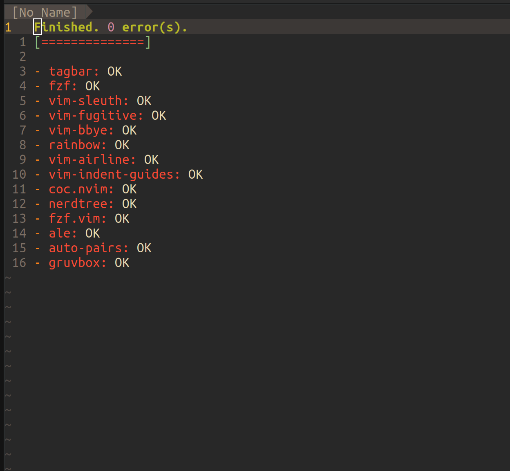

### Reference

Before I start, make sure to checkout [the GitHub repository](https://github.com/chinapandaman/vim-config) which contains all the configs and scripts I will be covering in this series of blogs.

### Plugin Managing

To make Vim as beefy as an IDE, it is not possible without plugins, at least for me. Vim has a large and active community and there are thousands of plugins out there that can boost my developing experience.

To install plugins I will first need a plugin manager. In my case the plugin manager I picked is [vim-plug](https://github.com/junegunn/vim-plug).

Installing vim-plug is quite simple:

```shell
curl -fLo ~/.vim/autoload/plug.vim --create-dirs https://raw.githubusercontent.com/junegunn/vim-plug/master/plug.vim
```

The actual usage of vim-plug revolves around modifying my `.vimrc` file. The below snippet exists at the very top of it:

<!-- more -->

```vim
call plug#begin()
    " a list of plugins to install
    Plug 'morhetz/gruvbox'
call plug#end()
```

By adding plugins between the two `call` blocks, vim-plug allows me to easily add/change/remove plugins via my `.vimrc` file.

After defining plugins, I can simply install them by running `:PlugInstall` within Vim. And after the installation has completed, I can check the status of plugins by running `:PlugStatus`. Here is a screenshot of the UI:



So now I have setup vim-plug which allows me to utilize plugins to expand Vim.

### Making My Configuration Portable

The other thing that came to my mind is that I want to make my Vim configuration as portable as I can. So whenever I'm on a new machine it will require minimum effort to restore my config.

To achieve this I will need to write some `bash` script. Here is what I have:

```bash
# setup.sh
rm -rf ~/.vim/
curl -fLo ~/.vim/autoload/plug.vim --create-dirs https://raw.githubusercontent.com/junegunn/vim-plug/master/plug.vim
cp .vimrc ~/.vimrc
vim +PlugInstall +qa
```

Let's look at this line by line.

The first line removes the current existed `~/.vim/` directory, allowing me to have a fresh, plugin free Vim environment for my own config.

The second line is the same command that installs vim-plug which we have covered in the last section.

The third line copies my `.vimrc` to where the file should be at on the designated machine. In the future `.vimrc` will contain a lot of configs I will be making. But for now it simply has all the needed plugins managed by vim-plug.

The last line is a sequence of commands. It first launches Vim, runs the command `:PlugInstall` which installs all the plugins via vim-plug, and finally runs the command `:qa` which quits Vim. It may seem a bit complex but all it's doing is installing plugins.

From here, I can make use of my own Vim configuration on any machine by just running:

```shell
bash setup.sh
```

And the `bash` script will cleanup the Vim environment, install vim-plug, install my vim config, and install all plugins needed for the config.

### Conclusion

In this blog, I have gone over some boilerplate steps that would make configuring and making use of a Vim config easier.

In the next article I will talk about some simple configurations that would enhance the basic editing experience.
