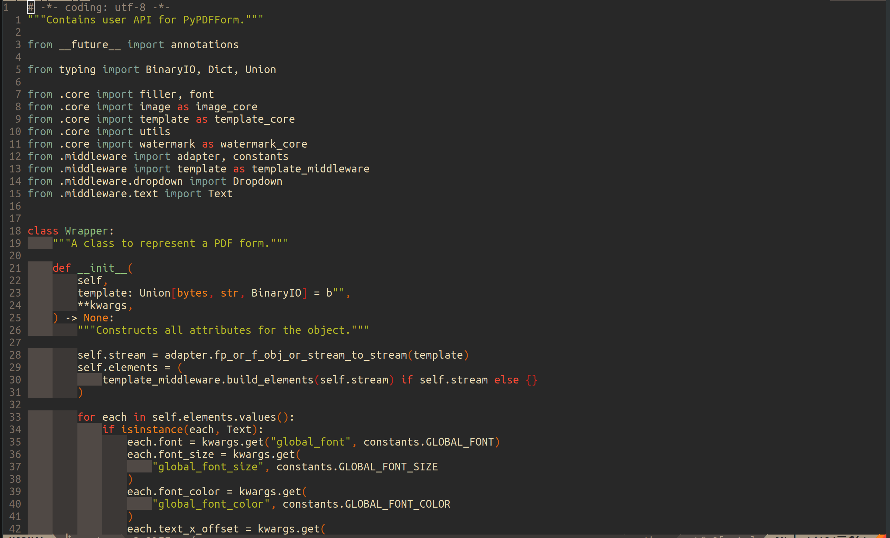
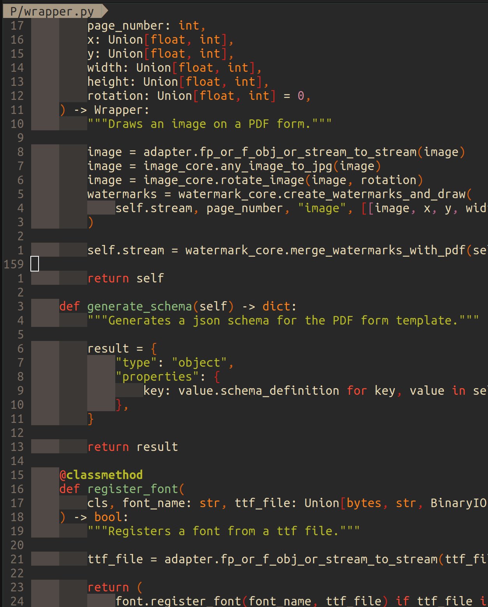
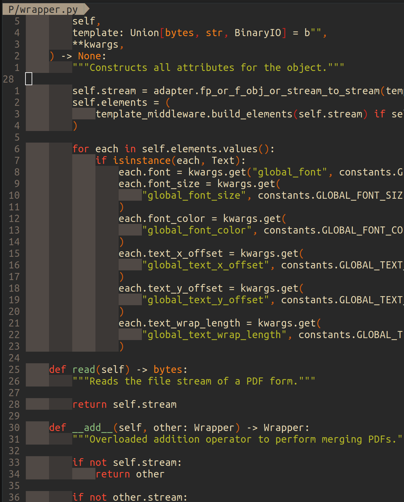
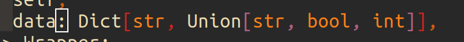
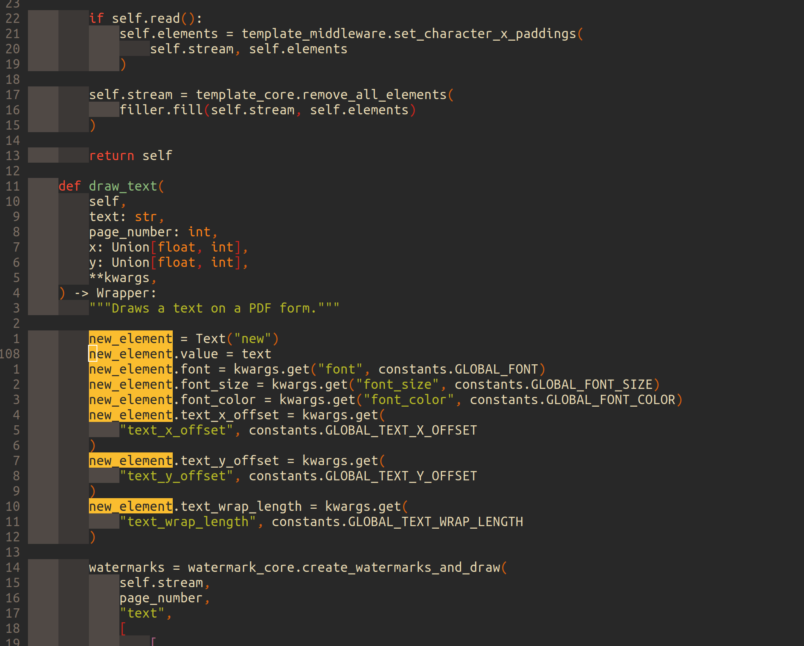

### Finding Plugins

In the previous blog, I discussed how to use vim-plug to manage plugins. So the question now is how do I find all those fancy plugins out there?

On top of just simply google and browse through GitHub, there is a website called [VimAwesome](https://vimawesome.com/) which allows me to browse and search different plugins by categories.

In this blog, I will be talking about some basic plugins and configs that would boost my basic editing experience.

<!-- more -->

### Theme

Every coder wants their IDE to look fancy, I think everyone of us can admit that and I'm no exception. After carefully evaluating a lot of popular themes out there the theme I chose in the end is the dark mode of [gruvbox](https://github.com/morhetz/gruvbox) for two reasons:

* It is the default theme for [SpaceVim](https://spacevim.org/), which is one of the more successful Vim config project in the community.
* Out of all the themes I have tried, gruvbox has the best syntax highlighting, especially for some less popular languages like Groovy.

Gruvbox can be installed just like a plugin, and to use the dark mode of it I have to set the background to dark. Finally enabling terminal GUI colors will give the theme a richer set of colors to work with:

```vim
call plug#begin()
    " other plugins
    Plug 'morhetz/gruvbox'
call plug#end()

colo gruvbox
set background=dark
set termguicolors
```

Here is a screenshot of the theme:



### Line Numbers

No one codes without line numbers. Line numbers help us to better navigate through files, especially during collaborative coding. Furthermore line numbers have an added benefit for Vim which is making navigation using the j and k key bindings much more efficient.

Vim supports three types of line numbers. The first type is the usual line number that one would normally see in other IDEs. It can be turned on by adding this to `.vimrc` file:

```vim
set number
```

This type of line number is called absolute line number, as it shows the absolute position of each line of code.

The second type of line number is called relative line number, which can be turned on by adding this to `.vimrc` file:

```vim
set relativenumber
```

For relative line number, the line number on each line of code is the relative distance to the line where your cursor is on. This type of line number is extremely useful for Vim as I navigate through files using the "number + j" or "number + k" key bindings.

If I combine the absolute and relative line number by adding both of them to `.vimrc` file:

```vim
set number
set relativenumber
```

I create the third type of line number, which is called hybrid line number. For this type of line number, it will display relative line numbers for any other lines in the file, except the line where your cursor is on in which it will display absolute line number. Here is a screenshot:



Hybrid line number combines the best of absolute and relative line number, allows me to benefit from both the j and k key binding navigation Vim provides and knowing exactly where I'm at within the file. And because of that, hybrid line number is my default config for Vim when it comes to line numbers.

### Indentation

Personally I'm not a big fan of re-configuring indentation for different types of files. So I found a very interesting plugin called [vim-sleuth](https://github.com/tpope/vim-sleuth) which automatically adjusts indentation for me:

```vim
call plug#begin()
    " other plugins
    Plug 'tpope/vim-sleuth'
call plug#end()
```

On top of vim-sleuth, [vim-indent-guides](https://github.com/preservim/vim-indent-guides) is another plugin I use to better visualize indentations. This plugin enables displaying of indent levels and is great for when I work with languages like Python:

```vim
call plug#begin()
    " other plugins
    Plug 'nathanaelkane/vim-indent-guides'
call plug#end()

let g:indent_guides_enable_on_vim_startup = 1
```

Here is a screenshot of vim-indent-guides:



### Syntax Highlighting

Obviously when I'm coding, I will want syntax highlighting on for my code:

```vim
syntax on
```

### Backspace

In Vim, backspace does not function as a key binding for deletion by default. This can be changed by adding the following to `.vimrc` file:

```vim
set backspace=indent,eol,start
```

### Round/Square/Curly Brackets

When coding, it is almost inevitable to work with the three types of brackets: round, square, and curly. To make the editing experience for them better on Vim there are two plugins I use.

The first one is called [auto-pairs](https://github.com/jiangmiao/auto-pairs). This small plugin will insert and delete brackets in pair, which is a feature that most other modern IDEs have by default.

The second one is called [rainbow](https://github.com/luochen1990/rainbow). This plugin helps me to read code with many nested levels of brackets by showing different levels of them in different colors.

```vim
call plug#begin()
    " other plugins
    Plug 'jiangmiao/auto-pairs'
    Plug 'luochen1990/rainbow'
call plug#end()

let g:rainbow_active = 1
```

Here is a screenshot of rainbow brackets:



These two plugins combined with Vim's builtin key binding for % have helped me deal with any situation when it comes to brackets.

### Search Highlight

When I use Vim's builtin search functionality, I always want my searches to be highlighted. So I added this line to my `.vimrc` file:

```vim
set hlsearch
```

Here is a screenshot of the effect:



### Conclusion

In this blog, I have covered some plugins and configs that improve quality of life when it comes to the basic editing experience of Vim.

In the next article, I will talk about buffers, one of the core features for any IDE that enables working with multiple files and how I make my Vim experience better when working with them.
