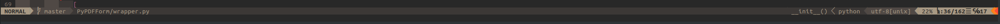
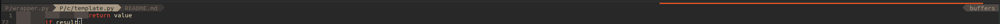
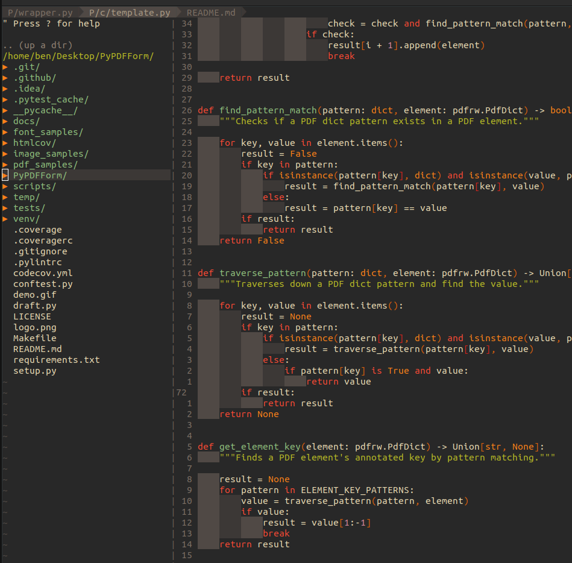

### Thank You Bram

Before I start this blog today, please allow me to express my deepest grieving to Mr. Bram Moolenaar, the author of Vim who just left us forever. Without your work many of us developers will never have the opportunity of using such a great tool that boosts our efficiency. You, like many other contributors, are the true martyr to the spirit of open source.

### Buffer Intro

A buffer is an area of Vim's memory used to hold text read from a file. Buffers are what allow Vim to edit multiple files simultaneously and switch between each of them. In this blog, I will be talking about some plugins and configs that make editing buffers of Vim an experience similar to a modern IDE.

<!-- more -->

### Tabs

Pretty much all modern IDEs have a tabline at the top of their UI. Whenever we open a new file it adds a new tab to it. We can navigate through files we opened by navigating through different tabs. Vim’s buffer plays a similar role, except with its default behavior we will need to use commands like `:buffers` or `:ls` to know what each buffer holds and then navigate from there. Is there an easier way?

Luckily, one of Vim’s most popular plugins, [vim-airline](https://github.com/vim-airline/vim-airline), provides a very neat tabline. We can install the plugin like this:

```vim
call plug#begin()
    " other plugins
    Plug 'vim-airline/vim-airline'
call plug#end()

let g:airline_powerline_fonts = 1
```

Note that the `airline_powerline_fonts` config requires [Powerline Fonts](https://github.com/powerline/fonts). After running `:PlugInstall` Vim will be geared with a lean and meaningful status bar at the bottom.



Notice how the status bar shares the same theme as my Vim without further configuring which is very nice.

Now we just need to add this config to enable the tabline:

```vim
let g:airline#extensions#tabline#enabled = 1
```



So now we have a much cleaner visual view of buffers that are opened, but navigating between them still requires commands like `:b <buffer>` or `:bnext`. So the next step I did was to map the Tab key for buffer navigation:

```vim
nnoremap <Tab> :bn<CR>
nnoremap <S-Tab> :bp<CR>
```

By adding the above configs, I'm able to go forwards with Tab and backwards with Shift + Tab keys through the tabline.

### File Explorer

A file tree explorer is also equipped for pretty much all modern IDEs. Nowadays as I’m more and more experienced with Vim and working with terminals I find myself using visual file explorer less and less. But I still think for some complex projects with many levels of nested directories a file explorer can come quite handy.

Vim's best known file explorer is the good old [NERDTREE](https://github.com/preservim/nerdtree):

```vim
call plug#begin()
    " other plugins
    Plug 'scrooloose/nerdtree'
call plug#end()
```

Once installed, there are some small configs I added for it:

```vim
nnoremap <Leader>m :NERDTreeToggle<CR>
let NERDTreeShowHidden=1
```

The first line is simply a keybinding I mapped to more easily open and close NERDTREE. The second line is to enable displaying of hidden files, as in most cases I will need to edit files like `.gitignore` or even `.vimrc`.




### Split Navigations

Vim allows creating different splits in a view and has a big room for customization. This enables infinite possibilities as each split’s buffer can display more than just files opened. In fact many plugins, like NERDTREE discussed in the previous section, utilizes splits to display its UI.

In general though, developers will almost always use split’s basic functionalities like vertical splits which allows them to view different files side by side. Vim allows navigation of splits with `:wincmd <ijkl>` which is in my opinion not the most convenient way. What I personally find out is that since Vim’s navigation within code blocks can already be done through the `ijkl` keys, it frees up the four arrow keys which I decided to map them to navigations between splits:

```vim
nnoremap <Up> :wincmd k<CR>
nnoremap <Down> :wincmd j<CR>
nnoremap <Left> :wincmd h<CR>
nnoremap <Right> :wincmd l<CR>
```

### Closing Buffers

One of the most annoying things when working with Vim is that you have all your splits set up and organized perfectly. Then you run `:bdelete` to delete a buffer and then Vim closes all windows that have the buffer opened and your layout is completely messed up. The good news is there is a small plugin that solves this exact problem named [vim-bbye](https://github.com/moll/vim-bbye):

```vim
call plug#begin()
    " other plugins
    Plug 'moll/vim-bbye'
call plug#end()

nnoremap <Leader>q :Bdelete<CR>
```

By adding the above configs I'm able to close the current buffer with a \ + q keybind without messing up my current split layout.


### Conclusion

In this blog, I went over how I have been interacting with Vim's buffers. Buffers are one of Vim's most powerful core functionalities and what makes Vim so customizable UI wise. Even though this is my current most comfortable way of using it I have only scratched the surface of the iceberg.

In the next article, I will be going over how I configured my Vim to do searches and Git related workflows.
